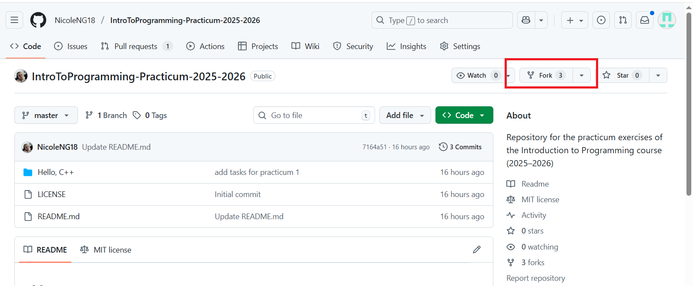
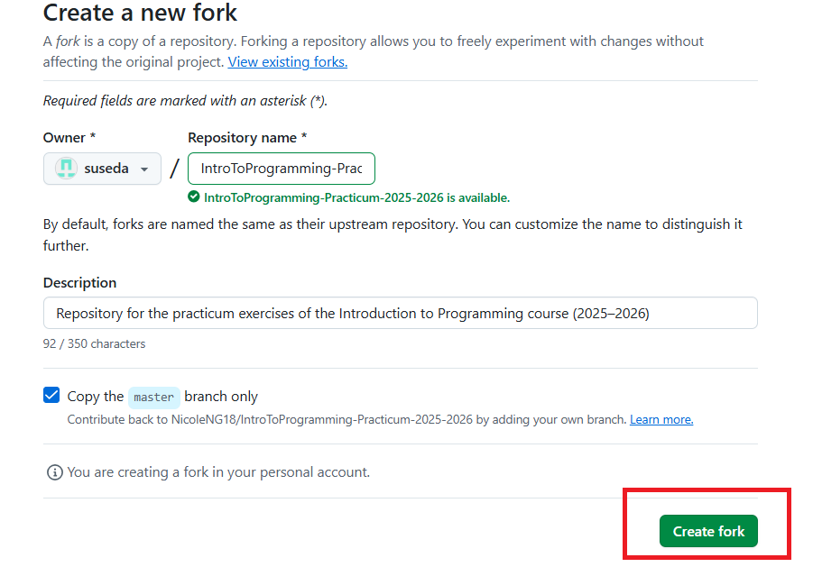
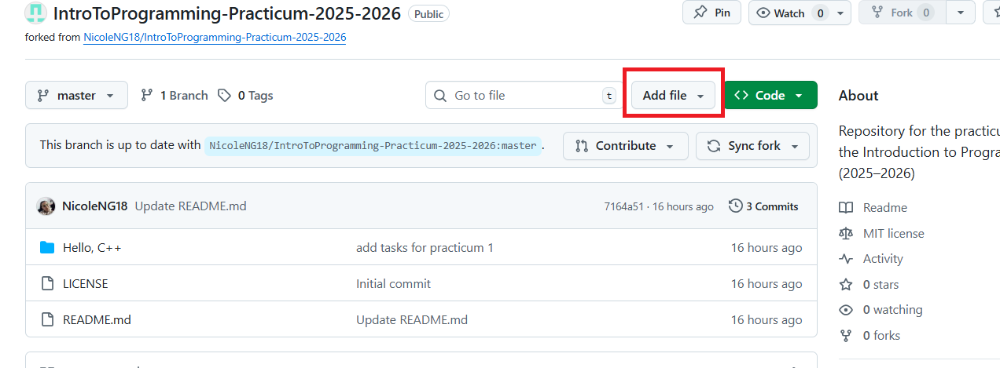
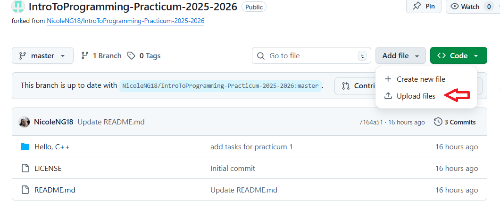
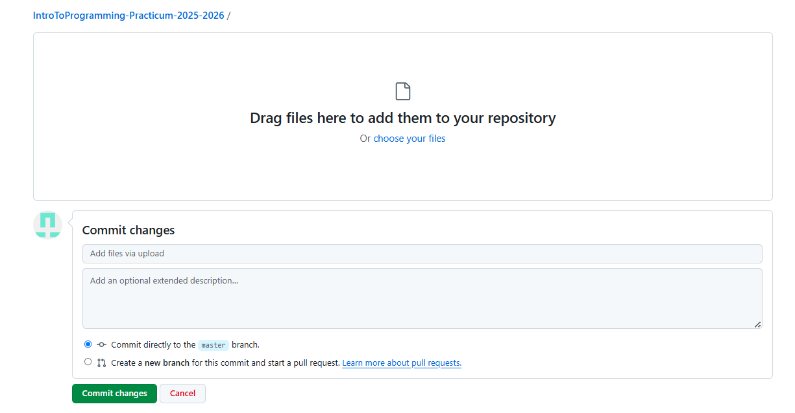
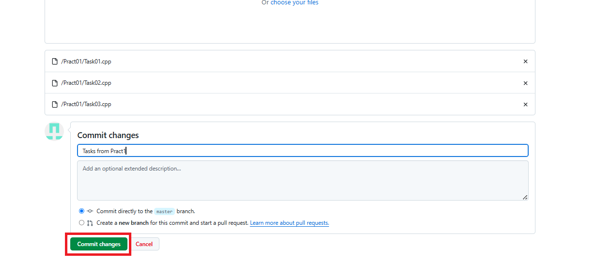
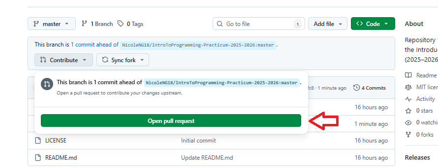
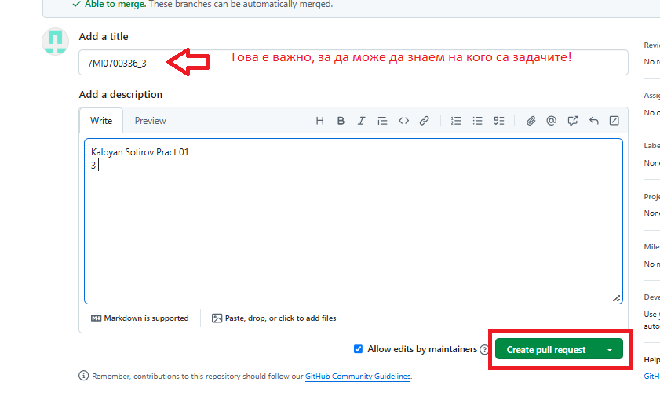

# GitHub Contribution Helper

This guide explains how to fork a repository, add files, and submit a Pull Request (PR).

---

## 1. Create a Fork

1. Open the repository you want to contribute to.
2. Click **Fork** in the top-right corner.

   
3. Optionally, rename your forked repo.
4. Click **Create fork**.
   
   

---

## 2. Add Files to Your Fork

1. Open your forked repository.
2. Navigate to the folder where you want to add files.
3. Click **Add file → Upload files**.

      

      

4. Upload your `.cpp` files from your local machine.

   * Use clear filenames (e.g., `Task1.cpp`).
5. Write a descriptive commit message.
6. Click **Commit changes**.


 
 

---


## 3. Create a Pull Request (PR)

1. In your forked repository, click **Contribute → Open Pull Request**.
 
 


2. Add a PR title in the format:

   ```
   facultyNumber_Group
   ```
3. In the description, include:

   * Your full names
   * Your group number
4. Click **Create Pull Request**.
 
 


5. Wait for review and approval.

---

## ⚠️ Keeping Your Fork Updated

To keep your fork in sync with the original repo:

* Once a week, go to your repo and click **Sync fork → Update branch**.

---


How to Run C++ on Microsoft Visual Studio 2022: 

https://www.youtube.com/watch?v=HS4c3kBEWr4

